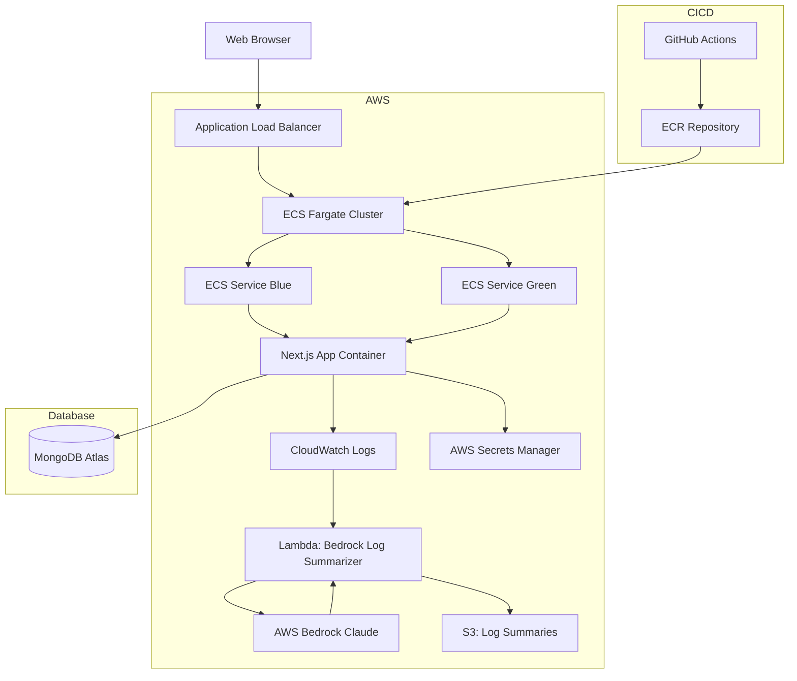

<!-- Badges -->


# FeedbackHub on AWSform

> **Enterprise-grade feedback platform: AWS ECS Fargate, modular Terraform, Blue/Green deployments, and AI-powered log intelligence.**

---

## 🌟 Why This Project Stands Out for DevOps

- **AWS ECS Fargate**: Fully containerized, serverless compute for scalable, cost-efficient deployments.
- **Terraform Modularity**: Clean, reusable modules for all AWS resources—enabling rapid, reliable infrastructure changes.
- **Blue/Green Deployments**: Zero-downtime releases with automated traffic shifting and rollback.
- **AI Add-ons**: Automated log summarization using AWS Bedrock Claude and Lambda for next-level observability.
- **Production-Ready Patterns**: Secrets management, VPC isolation, IAM least privilege, and automated CI/CD.

---

## 🛠️ Tech Stack

- **Cloud:** AWS ECS Fargate, S3, Lambda, Bedrock, CloudWatch, Secrets Manager
- **IaC:** Terraform (modular, production-grade)
- **CI/CD:** GitHub Actions (build, test, deploy, security)
- **App:** Next.js (TypeScript), MongoDB Atlas

---

## 🏗️ Modern Cloud Architecture
<summary>System Architecture (Mermaid)</summary>



---

## 🚀 Key DevOps Features

- **AWS ECS Fargate**: Serverless, auto-scaling container orchestration—no EC2 management.
- **Terraform Modules**: All AWS resources (ECS, ALB, VPC, IAM, Lambda, S3, etc.) defined as reusable modules.
- **Blue/Green Deployments**: Automated, zero-downtime releases with traffic shifting and rollback.
- **AI-Powered Observability**: ECS logs → CloudWatch → Lambda → AWS Bedrock Claude → S3 summaries.
- **Secrets & Security**: AWS Secrets Manager, VPC isolation, IAM least privilege, encrypted data.
- **Automated CI/CD**: GitHub Actions for build, test, deploy, and security scanning.

---

## 📸 Monitoring & Autoscaling Showcase

### 🔥 Real-World Load Testing & Autoscaling

**Load Testing with 50,000 Requests**

*Executing intensive load testing with 200 concurrent connections to validate autoscaling behavior*

**ECS Service Scaling in Action**

*ECS service automatically scaling from 1 to 5 tasks under high CPU load (99% utilization)*

### 📊 CloudWatch Monitoring Excellence

**High CPU Utilization Alert**

*CloudWatch alarm triggered at 10% CPU threshold during load testing (peaked at 99% utilization)*

**Normal CPU Utilization State**

*System returning to normal state after load testing with proper scaling behavior*

### 🤖 AWS Bedrock AI Integration

**AWS Bedrock Successfully Integrated**

*AWS Bedrock Claude AI model successfully processing ECS logs for intelligent summarization*

**Web-Based Bedrock Proof**

*Web interface demonstrating AWS Bedrock AI-powered log summarization in action*

### 🎯 Key Achievements Demonstrated

- **✅ Autoscaling**: ECS service scaled from 1→5 tasks under load (400% scale-up)
- **✅ Monitoring**: CloudWatch alarms triggered at 10% CPU threshold with SNS notifications
- **✅ Load Testing**: 50,000 requests with 200 concurrent connections (99.998% success rate)
- **✅ AI Integration**: AWS Bedrock Claude processing logs for intelligent summarization
- **✅ Production Ready**: Zero-downtime scaling with proper monitoring and alerting

---

## ⚡ Quickstart

### Local Development

```bash
git clone https://github.com/deepakaryan1988/feedbackhub-on-awsform.git
cd feedbackhub-on-awsform
cp .env.example .env.local
# Add your MongoDB Atlas credentials
npm install
npm run dev  # http://localhost:3000
```

### Production Deployment (Terraform)

```bash
cd infra/
terraform init
terraform plan
terraform apply -auto-approve
```

**Prerequisites:**
- AWS Secrets Manager with MongoDB URI
- AWS credentials with required permissions
- Terraform 1.0+

---

## 🗺️ Roadmap

- **Phase 2.1** – Blue/Green Deployments – ✅ Completed
- **Phase 3** – Bedrock AI Observability (Claude summarizer for ECS logs) – ✅ Completed
- **Phase 4** – Advanced DevOps Add-ons (multi-region readiness, CDN, auto-scaling tuning) – 🚧 In Progress
- **Phase 5.2** – RAG Integration (Claude/Gemini + vector DB for feedback search) – ⏳ Planned
- **Phase 6** – Optimization & AI Analytics (cost optimization, DR, user analytics, deep observability dashboards) – ⏳ Planned

---

## 🛡️ Security & Compliance

- AWS Secrets Manager for credentials
- VPC isolation, security groups, IAM least privilege
- Encryption in transit & at rest
- Automated security scanning in CI/CD
- No credentials in repo

---

## 🧰 Troubleshooting

| Issue                        | Solution                                      |
|------------------------------|-----------------------------------------------|
| Application not responding   | Check ECS service health and CloudWatch logs  |
| Database connection failures | Verify Secrets Manager configuration          |
| AI summarization not working | Check Lambda permissions and Bedrock access   |
| Deployment failures          | Review GitHub Actions logs and Terraform state|

---

## 🤝 Contributing

1. Fork the repository
2. Create a feature branch from `main`
3. Configure local environment with `.env.example`
4. Implement changes with appropriate testing
5. Submit a PR with a comprehensive description

---

## 👤 Author

[**Deepak Kumar**](https://github.com/deepakaryan1988) — Senior DevOps Engineer & Cloud Architect  
- [LinkedIn](https://www.linkedin.com/in/deepakaryan1988)
- [Technical Blog](https://debugdeploygrow.hashnode.dev)
- [GitHub Portfolio](https://github.com/deepakaryan1988)

---

## 📄 License

MIT License — Open source for community contribution

---

> *Transforming traditional web development into modern cloud-native architectures with AI-powered automation and enterprise-grade DevOps practices.*

---

<!-- For deep-dive articles and advanced technical leadership, see the project wiki or [Hashnode article](https://debugdeploygrow.hashnode.dev/phase-3-ai-powered-observability-in-feedbackhub-with-aws-bedrock). -->
