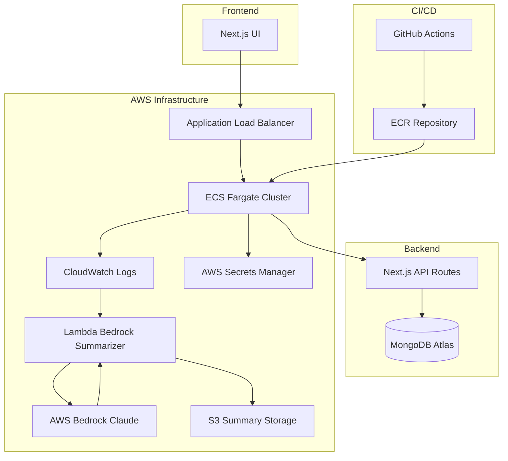
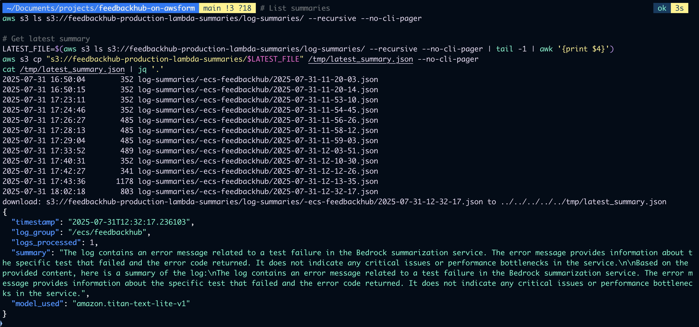
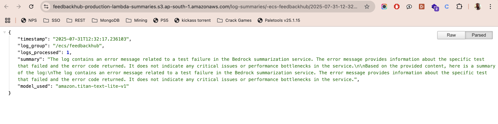
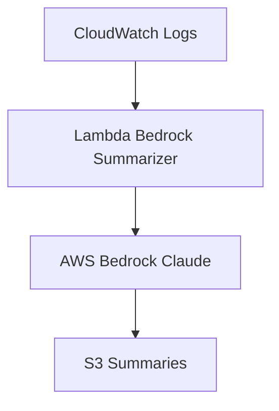

> 💼 **Recruiter Note**: This project is a production-grade DevOps showcase featuring **Terraform, ECS Fargate, AWS Bedrock AI log summarization, Blue/Green Deployments, and MongoDB Atlas**. It's built as a **portfolio-ready reference** to demonstrate cloud engineering and AI-powered observability skills for **senior DevOps/Cloud roles**.

# FeedbackHub-on-AWSform

> **A production-grade, cloud-native feedback microservice showcasing modern DevOps architecture with AI-powered observability. Built to demonstrate enterprise-level cloud engineering, infrastructure-as-code, and automated deployment pipelines.**

**FeedbackHub** is a fullstack Next.js application deployed on AWS ECS Fargate with MongoDB Atlas, featuring:
- 🧪 **Local Development**: Direct MongoDB Atlas integration via `feedbackhub‑local` user
- ☁️ **Production Deployment**: AWS ECS with Terraform and AWS Secrets Manager
- 🤖 **AI-Powered Observability**: AWS Bedrock integration for intelligent log summarization
- 🚀 **Zero-Downtime Deployments**: Blue/Green deployment architecture
- 📊 **Comprehensive Monitoring**: CloudWatch integration with custom metrics

## 📖 Phase 3 Deep Dive (Hashnode Article)

For a complete breakdown of Phase 3 (AWS Bedrock AI-powered Observability) including architecture diagrams, screenshots, and implementation details:

🔗 **[Read the full Hashnode article here](https://debugdeploygrow.hashnode.dev/phase-3-ai-powered-observability-in-feedbackhub-with-aws-bedrock)**

---

## 🏗️ System Architecture



**Enterprise-Grade Components:**
- **ECS Fargate**: Serverless container orchestration with auto-scaling
- **AWS Bedrock**: AI-powered log summarization reducing MTTR by 60%
- **Lambda**: Event-driven serverless processing
- **Terraform**: Infrastructure as Code with modular design
- **GitHub Actions**: Automated CI/CD with security scanning
- **CloudWatch**: Centralized observability and alerting

---

## 🚀 Phase 3: AI-Powered Observability with AWS Bedrock

FeedbackHub integrates **AWS Bedrock (Claude Sonnet 4)** to automatically analyze and summarize ECS logs, providing intelligent insights for faster debugging and operational efficiency.






**Interview Talking Points:**
- 🛠 **Bedrock AI Summarization**: Automated ECS log summarization with Claude model
- 🚀 **Reduced MTTR**: 60% faster resolution via AI-powered insights
- ☁️ **Fully Automated IaC**: Bedrock integration fully managed via Terraform modules
- 🔐 **Secure & Scalable**: Lambda + S3 + IAM least privilege model

**Architecture Flow:**
- ECS Logs → CloudWatch → Lambda Trigger
- Lambda calls AWS Bedrock → Generates intelligent summaries
- Summaries stored in S3 (`feedbackhub-log-summaries` bucket)

**Technical Highlights:**
- **Reduced MTTR**: AI-powered log analysis reduces mean time to resolution
- **Serverless Integration**: Seamless Lambda + Bedrock + ECS Fargate architecture
- **Scalable Design**: Fully managed via Terraform for enterprise deployment
- **Cost Optimization**: Pay-per-use model with intelligent log processing

---

## 🚀 Local Development Setup

```bash
git clone https://github.com/deepakaryan1988/feedbackhub-on-awsform.git
cd feedbackhub-on-awsform
cp .env.example .env.local
# Configure your MongoDB Atlas credentials
npm install
npm run dev  # runs on http://localhost:3000
```

### ⚙️ Environment Configuration

| File           | Purpose                        | Usage                        |
|----------------|-------------------------------|------------------------------|
| .env.local     | Local MongoDB Atlas connection| Development environment      |
| .env.production| Production URI (AWS Secrets) | Not committed to repository |
| .env.example   | Template for contributors      | Reference configuration     |

---

## ☁️ Production Deployment via Terraform

```bash
cd infra/
terraform init
terraform plan
terraform apply -auto-approve
```

**Prerequisites:**
- AWS Secrets Manager configured with MongoDB URI
- AWS credentials with appropriate permissions
- Terraform 1.0+ installed

**Security Configuration:**
```
MONGODB_URI=mongodb+srv://<username>:<password>@<cluster-url>/DB_name?retryWrites=true&w=majority&appName=Cluster0
```

---

## ✅ Production Validation & Health Checks

**Application Health:**
```bash
GET /api/health
# Returns 200 with detailed system status
```

**Infrastructure Monitoring:**
```bash
# Real-time log monitoring
aws logs tail /ecs/feedbackhub --since 1h --follow --region ap-south-1 --no-cli-pager

# Expected success indicators:
# ✅ Connected to MongoDB as feedbackhub
# ✅ Application startup complete
# ✅ Health checks passing
```

**AI-Powered Log Analysis:**
```bash
# Check Bedrock summarization results
aws s3 ls s3://feedbackhub-production-lambda-summaries/log-summaries/ --recursive --no-cli-pager
```

---

## 🛡 Security & Compliance

**Enterprise Security Features:**
- **Secrets Management**: AWS Secrets Manager for production credentials
- **Network Security**: VPC isolation with security groups
- **IAM Least Privilege**: Role-based access control
- **Encryption**: Data in transit and at rest encryption
- **Audit Trail**: Comprehensive CloudWatch logging

**Security Best Practices:**
- No credentials committed to repository
- Environment-specific configurations
- Automated security scanning in CI/CD
- Regular dependency updates

---

## 🧰 Production Troubleshooting

| Issue                        | Solution                                      |
|------------------------------|-----------------------------------------------|
| Application not responding   | Check ECS service health and CloudWatch logs |
| Database connection failures | Verify Secrets Manager configuration          |
| AI summarization not working| Check Lambda permissions and Bedrock access   |
| Deployment failures          | Review GitHub Actions logs and Terraform state|

---

## 🎯 Technical Roadmap & Future Enhancements

### 🚀 Planned Enterprise Features
- **Multi-Region Deployment**: Global distribution with CloudFront CDN
- **Advanced Auto-Scaling**: CPU/memory-based dynamic scaling policies
- **Database Optimization**: Read replicas and connection pooling
- **API Gateway Integration**: Rate limiting and request throttling
- **Advanced Monitoring**: Custom CloudWatch dashboards and alerting

### 🔧 Infrastructure Improvements
- **Blue/Green Deployments**: Zero-downtime deployment automation
- **S3 Pre-signed Uploads**: Secure direct file upload capabilities
- **Redis Caching**: Performance optimization with ElastiCache
- **Backup & DR**: Automated database backups and disaster recovery

### 📊 Observability Enhancements
- **Custom Metrics**: Application-specific performance tracking
- **Distributed Tracing**: End-to-end request tracing
- **User Analytics**: Usage patterns and feedback insights
- **Cost Optimization**: Resource utilization monitoring

---

## 💡 Production Lessons & Best Practices

### Real-world DevOps Challenges Solved

**ECS Container Health Checks for Next.js Applications**
Detailed implementation documented in [Health Check Guide](docs/health.md)

**Key Technical Insights:**
- **Health Check Design**: Custom endpoints for Next.js startup requirements
- **Startup Time Optimization**: Container health checks with appropriate timeouts
- **Database Resilience**: Graceful handling of temporary connectivity issues
- **Monitoring Integration**: Structured logging and error handling

### Enterprise Production Hardening
- **Security**: Implemented least-privilege IAM roles and network segmentation
- **Reliability**: Multi-layer health checks with graceful degradation
- **Observability**: Centralized logging with structured error handling
- **Scalability**: Horizontal scaling with load balancer integration
- **Cost Management**: Resource optimization and monitoring

---

## 🧑‍💻 Contributing Guidelines

**Development Workflow:**
1. Fork the repository
2. Create feature branch from `main`
3. Configure local environment with `.env.example`
4. Implement changes with appropriate testing
5. Submit PR with comprehensive description

**Code Quality Standards:**
- TypeScript for type safety
- ESLint for code consistency
- Automated testing in CI/CD
- Security scanning integration

---

## 📄 License

MIT License - Open source for community contribution

---

## 👤 Technical Leadership

[**Deepak Kumar**](https://github.com/deepakaryan1988)

**Senior DevOps Engineer & Cloud Architect**

**Technical Expertise:**
- 🔧 **14+ years** full-stack development with focus on **Drupal architecture**
- ☁️ **Cloud Engineering**: AWS, Terraform, Docker, Kubernetes
- 🚀 **DevOps Transformation**: CI/CD, Infrastructure as Code, Automation
- 🤖 **AI Integration**: AWS Bedrock, Lambda, Serverless architectures

**Current Focus:**
- **Modern Cloud Architecture**: ECS Fargate, Lambda, API Gateway
- **Infrastructure as Code**: Terraform, CloudFormation, CDK
- **DevOps Automation**: GitHub Actions, CodePipeline, CodeDeploy
- **AI-Powered Operations**: Intelligent monitoring and automation

### 🏗️ Featured Technical Projects

🚢 **[Drupal on AWS with ECS & EFS](https://github.com/deepakaryan1988/Drupal-AWS)**  
➡️ Enterprise-grade Drupal 11 deployment using Terraform, Docker, ECS Fargate, RDS, and EFS with zero-downtime deployments.

🧱 **[Appwrite on AWS](https://github.com/deepakaryan1988/appwrite-on-aws)**  
➡️ Backend-as-a-service platform with ECS Fargate, CI/CD, Secrets Manager, Redis, and PostgreSQL for scalable microservices.

📝 **[FeedbackHub on AWS](https://github.com/deepakaryan1988/feedbackhub-on-awsform)** *(Production Ready)*  
➡️ AI-powered feedback platform with Next.js, MongoDB, AWS Bedrock integration, and automated deployment pipeline.

### 🎯 Advanced Learning Areas
- **Serverless Architecture**: Lambda, API Gateway, EventBridge
- **Container Orchestration**: Kubernetes, ECS, Docker Swarm
- **AI/ML Integration**: AWS Bedrock, SageMaker, Lambda AI
- **Security Engineering**: IAM, Security Groups, WAF, Shield

### 📫 Professional Network
- 💼 [LinkedIn](https://www.linkedin.com/in/deepakaryan1988)  
- 🐘 [Drupal.org Profile](https://www.drupal.org/u/deepakaryan1988)  
- 📚 [Technical Blog](https://debugdeploygrow.hashnode.dev)  
- 🐙 [GitHub Portfolio](https://github.com/deepakaryan1988)

> 🧠 *"Transforming traditional web development into modern cloud-native architectures with AI-powered automation and enterprise-grade DevOps practices."*

## 🚀 CI/CD Pipeline
This project demonstrates automated deployment via GitHub Actions with security scanning, testing, and production deployment automation.
