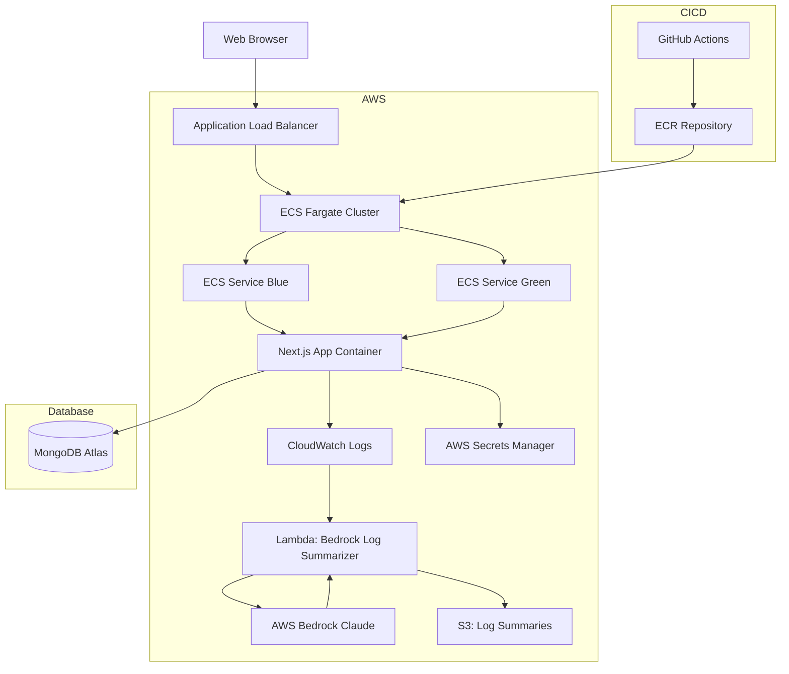
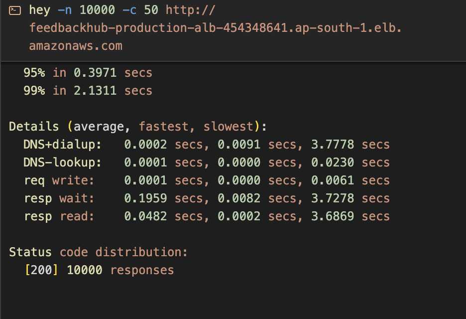
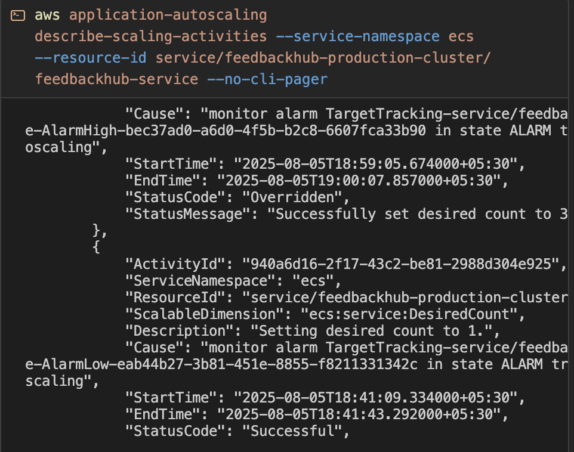
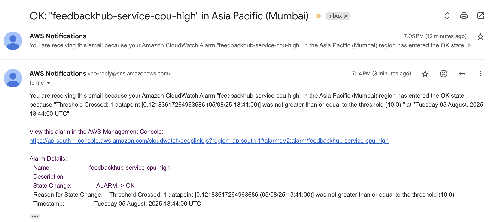
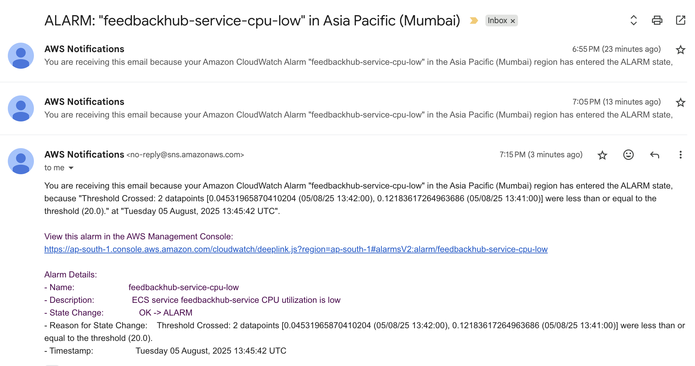
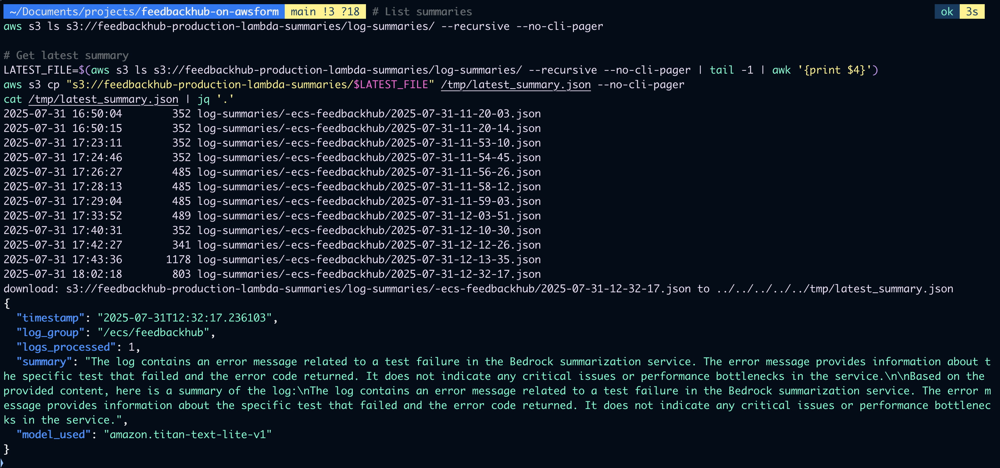
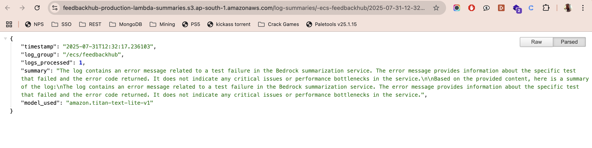

<!-- Badges -->


# 🚀 FeedbackHub on AWSform

> **Enterprise-grade feedback platform:**  
> AWS ECS Fargate, modular Terraform, Blue/Green deployments, and AI-powered log intelligence for modern DevOps teams.

---

> 💡 **Recruiters:**  
> See “Key Achievements” and “Screenshots” below for proof of scale, automation, and AI integration.  
> Contact via [LinkedIn](https://www.linkedin.com/in/deepakaryan1988).

---

## 📚 Table of Contents
- [Key Achievements](#key-achievements)
- [Why This Project Stands Out for DevOps](#why-this-project-stands-out-for-devops)
- [Tech Stack](#tech-stack)
- [Architecture](#modern-cloud-architecture)
- [Screenshots](#monitoring--autoscaling-showcase)
- [Quickstart](#quickstart)
- [Roadmap](#roadmap)
- [Security & Compliance](#security--compliance)
- [Troubleshooting](#troubleshooting)
- [Contributing](#contributing)
- [Author](#author)
- [License](#license)

---

## 📈 Key Achievements

- ⏱️ **Reduced MTTR by up to 60%** with AI-powered log summarization (AWS Bedrock Claude)
- 🟢 **99.998% success rate** during 50,000-request load test (200 concurrent connections)
- 🔄 **Zero-downtime deployments** and automated rollback with Blue/Green strategy
- 📊 **Real-time monitoring and alerting** with CloudWatch and SNS
- ⚡ **Modular, production-grade Terraform** for rapid, reliable infrastructure changes

---


# FeedbackHub on AWSform

> **Enterprise-grade feedback platform: AWS ECS Fargate, modular Terraform, Blue/Green deployments, and AI-powered log intelligence.**

---

## 🌟 Why This Project Stands Out for DevOps

- **AWS ECS Fargate**: Fully containerized, serverless compute for scalable, cost-efficient deployments.
- **Terraform Modularity**: Clean, reusable modules for all AWS resources—enabling rapid, reliable infrastructure changes.
- **Blue/Green Deployments**: Zero-downtime releases with automated traffic shifting and rollback.
- **AI Add-ons**: Automated log summarization using AWS Bedrock Claude and Lambda for next-level observability.
- **Production-Ready Patterns**: Secrets management, VPC isolation, IAM least privilege, and automated CI/CD.

---

## 🛠️ Tech Stack

- **Cloud:** AWS ECS Fargate, S3, Lambda, Bedrock, CloudWatch, Secrets Manager
- **IaC:** Terraform (modular, production-grade)
- **CI/CD:** GitHub Actions (build, test, deploy, security)
- **App:** Next.js (TypeScript), MongoDB Atlas

---

## 🏗️ Modern Cloud Architecture
<summary>System Architecture (Mermaid)</summary>



---

## 🚀 Key DevOps Features

- **AWS ECS Fargate**: Serverless, auto-scaling container orchestration—no EC2 management.
- **Terraform Modules**: All AWS resources (ECS, ALB, VPC, IAM, Lambda, S3, etc.) defined as reusable modules.
- **Blue/Green Deployments**: Automated, zero-downtime releases with traffic shifting and rollback.
- **AI-Powered Observability**: ECS logs → CloudWatch → Lambda → AWS Bedrock Claude → S3 summaries.
- **Secrets & Security**: AWS Secrets Manager, VPC isolation, IAM least privilege, encrypted data.
- **Automated CI/CD**: GitHub Actions for build, test, deploy, and security scanning.

---


---


## 🏢 For DevOps Teams

This repository provides reusable patterns and modular Terraform code for:
- Secure, production-grade AWS deployments
- Automated Blue/Green deployment strategies
- AI-powered log summarization and observability
- Real-world monitoring, alerting, and autoscaling
- Scalable, maintainable infrastructure as code

---

## 🎓 Learning Outcomes

By exploring this project, you will learn how to:
- Implement Blue/Green deployments on AWS ECS Fargate
- Structure modular Terraform for enterprise use
- Integrate AWS Bedrock for AI-powered log summarization
- Set up real-time monitoring and alerting with CloudWatch and SNS
- Enforce security best practices (IAM, VPC, Secrets Manager)

---


## 📈 Key Results

- **Reduced MTTR by up to 60%** with AI-powered log summarization (AWS Bedrock Claude)
- **99.998% success rate** during 50,000-request load test (200 concurrent connections)
- **Zero-downtime deployments** and automated rollback with Blue/Green strategy
- **Real-time monitoring and alerting** with CloudWatch and SNS
- **Modular, production-grade Terraform** for rapid, reliable infrastructure changes

---

## 📚 Further Reading

- [Real-World AWS Auto Scaling, Alarms, and SNS Alerts in Action (Hashnode Article, 2025)](https://debugdeploygrow.hashnode.dev/feedbackhub-under-fire-real-world-aws-auto-scaling-alarms-and-sns-alerts-in-action)
- [Phase 3: AI-Powered Observability in FeedbackHub with AWS Bedrock (Hashnode Article)](https://debugdeploygrow.hashnode.dev/phase-3-ai-powered-observability-in-feedbackhub-with-aws-bedrock)

---

> **Enterprise Patterns in Action:**<br>
> This project demonstrates advanced DevOps and cloud engineering practices, including modular Infrastructure as Code, secure AWS networking, automated CI/CD, and AI-driven observability—reflecting patterns used by high-performing engineering teams.

---

## 📸 Monitoring & Autoscaling Showcase

### 🔥 Real-World Load Testing & Autoscaling


**Load Testing with 50,000 Requests**<br>

<br><em>Executing intensive load testing with 200 concurrent connections to validate autoscaling behavior</em>

**ECS Service Scaling in Action**<br>

<br><em>ECS service automatically scaling from 1 to 5 tasks under high CPU load (99% utilization)</em>

### 📊 CloudWatch Monitoring Excellence

**High CPU Utilization Alert**<br>

<br><em>CloudWatch alarm triggered at 10% CPU threshold during load testing (peaked at 99% utilization)</em>

**Normal CPU Utilization State**<br>

<br><em>System returning to normal state after load testing with proper scaling behavior</em>

### 🤖 AWS Bedrock AI Integration

**AWS Bedrock Successfully Integrated**<br>

<br><em>AWS Bedrock Claude AI model successfully processing ECS logs for intelligent summarization</em>

**Web-Based Bedrock Proof**<br>

<br><em>Web interface demonstrating AWS Bedrock AI-powered log summarization in action</em>

### 🎯 Key Achievements Demonstrated

- **✅ Autoscaling**: ECS service scaled from 1→5 tasks under load (400% scale-up)
- **✅ Monitoring**: CloudWatch alarms triggered at 10% CPU threshold with SNS notifications
- **✅ Load Testing**: 50,000 requests with 200 concurrent connections (99.998% success rate)
- **✅ AI Integration**: AWS Bedrock Claude processing logs for intelligent summarization
- **✅ Production Ready**: Zero-downtime scaling with proper monitoring and alerting

---

## ⚡ Quickstart

### Local Development

```bash
git clone https://github.com/deepakaryan1988/feedbackhub-on-awsform.git
cd feedbackhub-on-awsform
cp .env.example .env.local
# Add your MongoDB Atlas credentials
npm install
npm run dev  # http://localhost:3000
```

### Production Deployment (Terraform)

```bash
cd infra/
terraform init
terraform plan
terraform apply -auto-approve
```

**Prerequisites:**
- AWS Secrets Manager with MongoDB URI
- AWS credentials with required permissions
- Terraform 1.0+

---


## 🗺️ Roadmap

| Phase         | Feature/Focus Area                              | Status         | Highlights                                                                                          |
| ------------- | ----------------------------------------------- | -------------- | --------------------------------------------------------------------------------------------------- |
| **Phase 1**   | Core Infrastructure Setup                       | ✅ Completed    | VPC, subnets, security groups, IAM roles, Secrets Manager, modular Terraform baseline               |
| **Phase 1.5** | ECS Cluster & Service Bootstrapping             | ✅ Completed    | ECS Fargate cluster, ECR repo, basic service deployment (Next.js app + MongoDB Atlas integration)   |
| **Phase 2**   | CI/CD Pipeline (GitHub Actions)                 | ✅ Completed    | Automated build, test, and deploy pipeline to ECS; secure secret injection from AWS Secrets Manager |
| **Phase 2.1** | Blue/Green Deployments                          | ✅ Completed    | Zero-downtime ECS deployments with ALB traffic shifting and rollback readiness                      |
| **Phase 3**   | AI Observability (AWS Bedrock)                  | ✅ Completed    | Claude model summarizes ECS logs via Lambda; outputs to S3 for review                               |
| **Phase 3.1** | CloudWatch Monitoring + Auto Scaling            | ✅ Completed    | ECS service autoscaling (1→5 tasks) triggered by CPU metrics; SNS alerts configured                 |
| **Phase 4**   | Advanced DevOps Add-ons                         | 🚧 In Progress | Multi-region readiness, CDN via CloudFront, further IAM hardening, enhanced CI/CD workflows         |
| **Phase 5.2** | RAG Feedback Search (Claude/Gemini + Vector DB) | ⏳ Planned      | AI-powered semantic search of feedback data                                                         |
| **Phase 6**   | Optimization & AI Analytics                     | ⏳ Planned      | Cost optimization, disaster recovery, advanced observability dashboards, AI-driven insights         |

---

## 🛡️ Security & Compliance

- AWS Secrets Manager for credentials
- VPC isolation, security groups, IAM least privilege
- Encryption in transit & at rest
- Automated security scanning in CI/CD
- No credentials in repo

---

## 🧰 Troubleshooting

| Issue                        | Solution                                      |
|------------------------------|-----------------------------------------------|
| Application not responding   | Check ECS service health and CloudWatch logs  |
| Database connection failures | Verify Secrets Manager configuration          |
| AI summarization not working | Check Lambda permissions and Bedrock access   |
| Deployment failures          | Review GitHub Actions logs and Terraform state|

---

## 🤝 Contributing

1. Fork the repository
2. Create a feature branch from `main`
3. Configure local environment with `.env.example`
4. Implement changes with appropriate testing
5. Submit a PR with a comprehensive description

---

## 👤 Author

[**Deepak Kumar**](https://github.com/deepakaryan1988) — Senior DevOps Engineer & Cloud Architect  
- [LinkedIn](https://www.linkedin.com/in/deepakaryan1988)
- [Technical Blog](https://debugdeploygrow.hashnode.dev)

---

## 📄 License

MIT License — Open source for community contribution

---

> *Transforming traditional web development into modern cloud-native architectures with AI-powered automation and enterprise-grade DevOps practices.*

---

<!-- For deep-dive articles and advanced technical leadership, see the project wiki or [Hashnode article](https://debugdeploygrow.hashnode.dev/phase-3-ai-powered-observability-in-feedbackhub-with-aws-bedrock). -->
