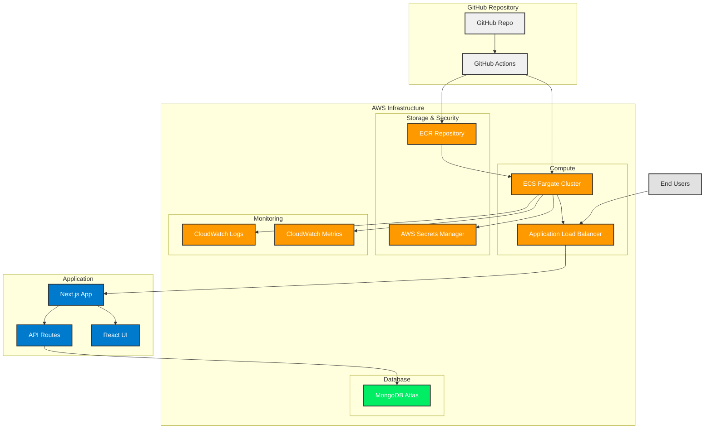

# FeedbackHub Architecture

## System Overview

FeedbackHub is a cloud-native microservice built with Next.js, MongoDB Atlas, and deployed on AWS ECS with full CI/CD automation.

## Architecture Diagram

## Key Components

### Frontend (Next.js)
- **React UI**: Modern, responsive feedback interface
- **API Routes**: Serverless functions for feedback operations
- **Static Generation**: Optimized for performance

### Backend Infrastructure
- **ECS Fargate**: Serverless container orchestration
- **Application Load Balancer**: Traffic distribution and SSL termination
- **ECR**: Container image registry

### Database & Security
- **MongoDB Atlas**: Managed NoSQL database
- **AWS Secrets Manager**: Secure credential management
- **IAM Roles**: Least-privilege access control

### CI/CD Pipeline
- **GitHub Actions**: Automated build and deployment
- **Docker**: Containerized application
- **Terraform**: Infrastructure as Code

### Monitoring & Observability
- **CloudWatch Logs**: Centralized logging
- **CloudWatch Metrics**: Performance monitoring
- **Health Checks**: Application and container health monitoring

## Data Flow

1. **Development**: Local development connects directly to MongoDB Atlas
2. **CI/CD**: GitHub Actions builds Docker image and pushes to ECR
3. **Deployment**: ECS pulls image from ECR and deploys to Fargate
4. **Runtime**: Application serves requests via ALB, stores data in MongoDB Atlas
5. **Monitoring**: All logs and metrics flow to CloudWatch

## Security Architecture

- **Network Security**: VPC with private subnets for ECS tasks
- **Application Security**: Secrets managed via AWS Secrets Manager
- **Database Security**: MongoDB Atlas with IP whitelisting
- **Container Security**: Non-root user, minimal base images
- **Transport Security**: HTTPS/TLS termination at ALB

## Scalability Features

- **Horizontal Scaling**: ECS auto-scaling based on CPU/memory
- **Load Balancing**: ALB distributes traffic across multiple containers
- **Database Scaling**: MongoDB Atlas handles read/write scaling
- **CDN Ready**: Static assets can be served via CloudFront 