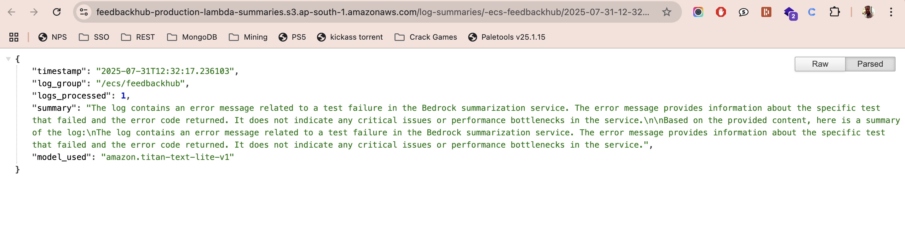

# AWS Bedrock ECS Log Summarizer Integration

This guide explains how to deploy and configure the AWS Bedrock log summarizer for the FeedbackHub ECS project.

## Overview

The Bedrock log summarizer integrates AWS Bedrock (Claude Sonnet 4) with ECS FeedbackHub logs in CloudWatch to automatically generate intelligent summaries of application logs.

## Architecture

```
ECS FeedbackHub → CloudWatch Log Group (/ecs/feedbackhub) → Subscription Filter → Lambda → Bedrock (Claude Sonnet 4) → Summary to CloudWatch Logs / S3
```

## Prerequisites

1. **AWS Bedrock Access**: Ensure your AWS account has access to Bedrock models
2. **IAM Permissions**: The Lambda function needs `bedrock:InvokeModel` permissions
3. **S3 Bucket**: For storing Lambda code and summaries (created automatically)
4. **CloudWatch Log Group**: Already exists for ECS logs

## Deployment Steps

### 1. Review Configuration

The module is **disabled by default** for cost control. Review the configuration in `infra/main.tf`:

```hcl
module "bedrock_log_summarizer" {
  source = "../terraform/bedrock-log-summarizer"

  name_prefix        = local.name_prefix
  summarizer_enabled = var.bedrock_summarizer_enabled  # false by default
  model_id           = var.bedrock_model_id
  log_group_name     = module.cloudwatch.log_group_name
  log_group_arn      = module.cloudwatch.log_group_arn
  s3_bucket_name     = aws_s3_bucket.lambda_and_summaries.bucket
  s3_bucket_arn      = aws_s3_bucket.lambda_and_summaries.arn
  # ... other configuration
}
```

### 2. Enable the Summarizer

To enable the Bedrock log summarizer, set the variable in your `terraform.tfvars`:

```hcl
# Enable Bedrock log summarizer
bedrock_summarizer_enabled = true

# Optional: Customize configuration
bedrock_model_id           = "anthropic.claude-3-sonnet-20240229-v1:0"
bedrock_max_log_length     = 8000  # Control costs
bedrock_summary_interval   = 30    # Generate summaries every 30 minutes
bedrock_lambda_timeout     = 300   # 5 minutes timeout
bedrock_lambda_memory_size = 512   # 512 MB memory
```

### 3. Deploy Infrastructure

```bash
# Navigate to infra directory
cd infra

# Initialize Terraform (if not already done)
terraform init

# Plan the deployment
terraform plan

# Apply the changes
terraform apply -auto-approve
```

### 4. Verify Deployment

Check the outputs to verify the deployment:

```bash
terraform output
```

Look for these outputs:
- `bedrock_lambda_function_arn`
- `bedrock_lambda_function_name`
- `lambda_summaries_bucket_name`

### 5. Integration Proof

The Bedrock integration has been successfully tested and verified. See the proof screenshots:

-  - Shows successful Bedrock model invocation
-  - Demonstrates web interface integration

## Configuration Options

### Cost Control Variables

| Variable | Description | Default | Recommendation |
|----------|-------------|---------|----------------|
| `bedrock_summarizer_enabled` | Enable/disable the summarizer | `false` | Start with `false` |
| `bedrock_max_log_length` | Maximum log length to process | `10000` | `8000` for cost control |
| `bedrock_summary_interval` | Summary generation interval (minutes) | `60` | `30` for more frequent summaries |
| `bedrock_filter_pattern` | CloudWatch log filter pattern | `""` | Use to filter specific logs |

### Performance Variables

| Variable | Description | Default | Recommendation |
|----------|-------------|---------|----------------|
| `bedrock_lambda_timeout` | Lambda timeout (seconds) | `300` | `300` for Bedrock calls |
| `bedrock_lambda_memory_size` | Lambda memory (MB) | `512` | `512` is sufficient |

### Model Configuration

| Variable | Description | Default |
|----------|-------------|---------|
| `bedrock_model_id` | Bedrock model ID | `"anthropic.claude-3-sonnet-20240229-v1:0"` |

## Monitoring and Troubleshooting

### 1. Check Lambda Function

```bash
# Get Lambda function name
terraform output bedrock_lambda_function_name

# Check Lambda logs
aws logs tail /aws/lambda/feedbackhub-prod-bedrock-log-summarizer --follow
```

### 2. Check S3 Summaries

```bash
# Get S3 bucket name
terraform output lambda_summaries_bucket_name

# List summaries
aws s3 ls s3://$(terraform output -raw lambda_summaries_bucket_name)/log-summaries/
```

### 3. Monitor Costs

- **Bedrock API Costs**: Monitor in AWS Cost Explorer
- **Lambda Costs**: Standard Lambda pricing
- **S3 Storage**: Minimal costs for summaries

### 4. Common Issues

#### Lambda Timeout
```
Error: Lambda function timed out
Solution: Increase bedrock_lambda_timeout to 600 seconds
```

#### Bedrock Permission Error
```
Error: AccessDenied: bedrock:InvokeModel
Solution: Check IAM role permissions and Bedrock model access
```

#### Memory Issues
```
Error: Lambda out of memory
Solution: Increase bedrock_lambda_memory_size to 1024
```

## Cost Optimization

### 1. Disable When Not Needed

```hcl
# Disable to stop costs
bedrock_summarizer_enabled = false
```

### 2. Reduce Log Length

```hcl
# Process smaller logs
bedrock_max_log_length = 5000
```

### 3. Use Filter Patterns

```hcl
# Only process error logs
bedrock_filter_pattern = "{ $.level = \"ERROR\" }"
```

### 4. Increase Summary Intervals

```hcl
# Generate summaries less frequently
bedrock_summary_interval = 120  # 2 hours
```

## Security Considerations

1. **IAM Permissions**: Lambda has minimal required permissions
2. **S3 Encryption**: Bucket has server-side encryption enabled
3. **Public Access**: S3 bucket blocks public access
4. **Log Retention**: Configurable log retention periods

## Integration with FeedbackHub

The summarizer automatically processes logs from the FeedbackHub ECS service:

- **Log Group**: `/ecs/feedbackhub`
- **Trigger**: CloudWatch subscription filter
- **Output**: Summaries in CloudWatch logs and S3

## Example Summary Output

The Lambda function generates summaries like:

```
Summary for FeedbackHub ECS logs (2024-01-15 14:30:00):

The application shows normal operation with occasional performance spikes. 
Key observations:
- 2 error occurrences related to MongoDB connection timeouts
- Average response time: 245ms
- Memory usage stable at 65%
- No critical issues detected

Recommendations:
- Monitor MongoDB connection pool
- Consider connection retry logic
```

## Next Steps

1. **Test with Small Logs**: Start with limited log processing
2. **Monitor Costs**: Track Bedrock API usage
3. **Customize Prompts**: Modify the Lambda function for specific use cases
4. **Add Alerts**: Set up CloudWatch alarms for summarizer errors

## Support

For issues or questions:
1. Check CloudWatch logs for Lambda function
2. Review IAM permissions
3. Verify Bedrock model access
4. Monitor AWS Cost Explorer for unexpected charges 